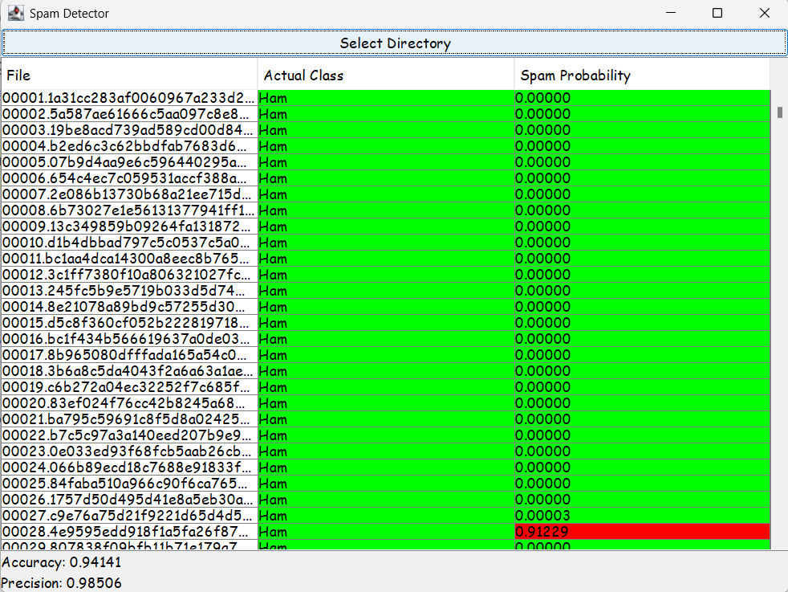
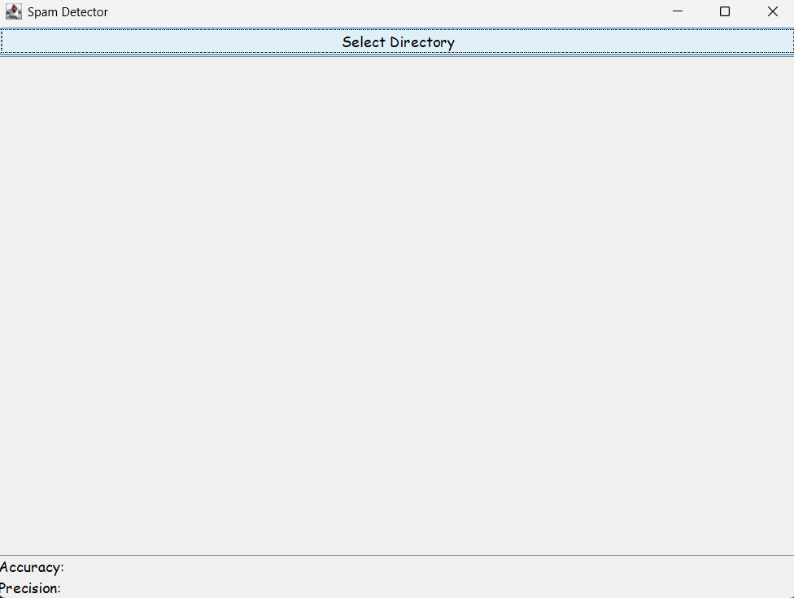
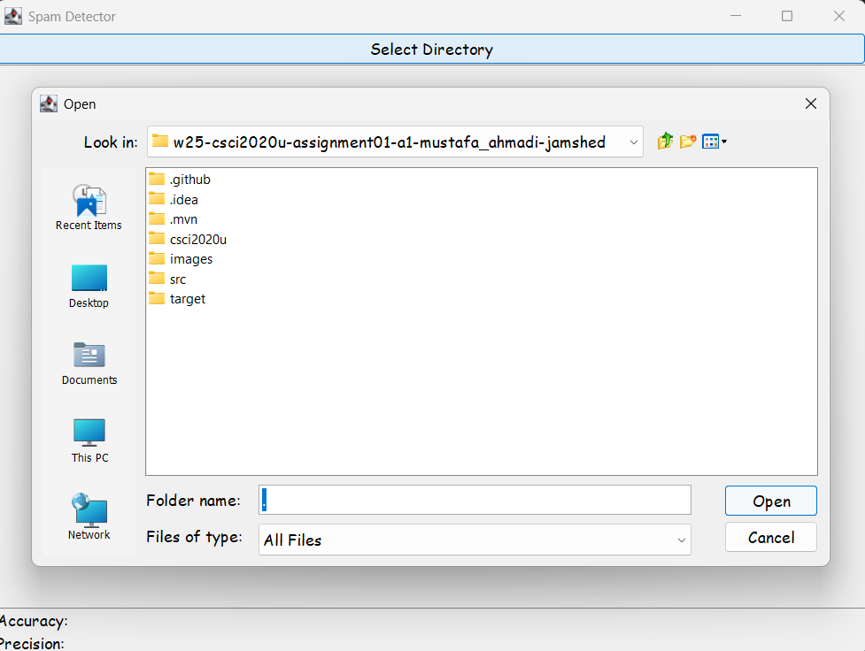
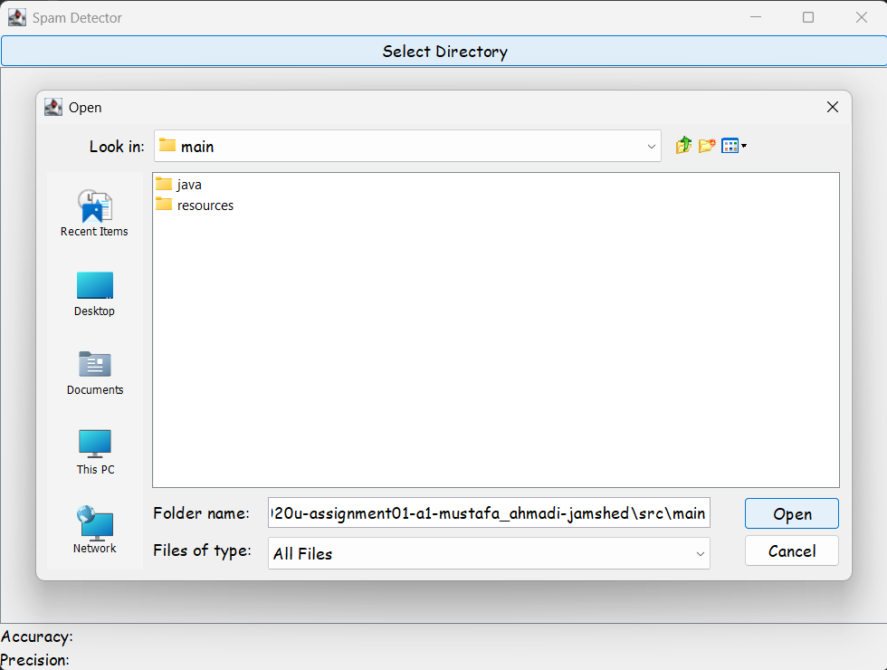
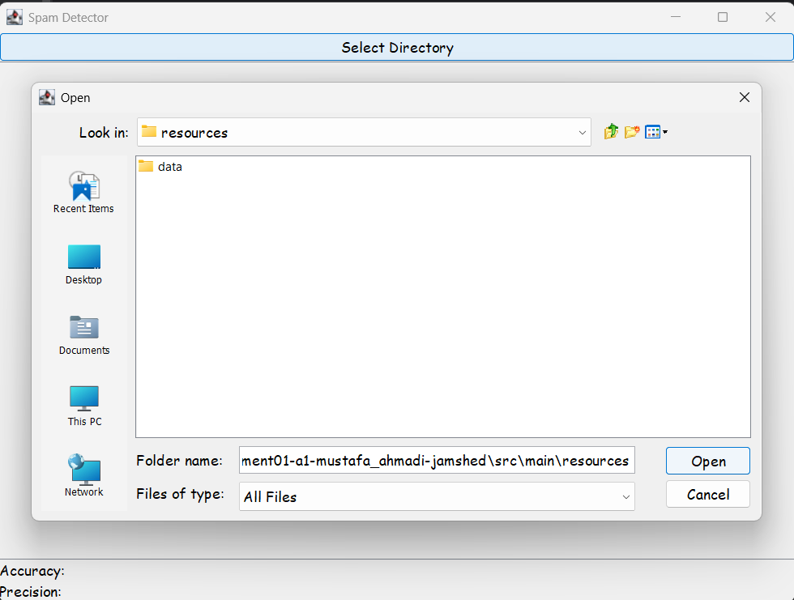

# Spam Detector
This project implements a Spam Detector using a Naive Bayes classifier trained on a dataset of spam and ham (non-spam) emails. The program analyzes word frequencies to calculate the probability of a message being spam. A graphical user interface (GUI) is provided to load datasets, train the model, and test email classifications.
Every word in the classification process is counted and linked to either spam or ham messages using a unigram approach. In order to efficiently handle small probability values, the model use logarithmic functions to estimate probabilities based on the words present in each email.
Users can load datasets, train the model, and categorize new emails using known probabilities utilizing the Graphical User Interface (GUI). In order to assess model performance, the application also computes classification accuracy and precision.
### Training Phase
- The program reads email files from the train folder, which contains subdirectories train/spam (spam emails) and train/ham (non-spam emails).
- The system extracts words from each email while ignoring case sensitivity.
- Each word is counted in the context of spam and ham messages, creating two frequency maps:
   - trainSpamFreq: Number of spam emails containing a word.
   - trainHamFreq: Number of ham emails containing a word.
- All probabilities are stored in a map for efficient lookup during testing.
### Testing Phase 
- The program evaluates messages in the test folder and each test email is processed word by word, using logarithmic calculations to avoid precision errors.
- If Pr(S|F) > threshold (default 0.6), the email is classified as spam
- The following formula is used to calculate the final spam probability: η = Σ [ ln(1 - Pr(S|W)) - ln(Pr(S|W)) ]
Pr(S|F) = 1 / (1 + e^η)
### Accuracy and Precision
- Accuracy = (Correct classifications) / (Total classifications)
- Precision = (True Positives) / (True Positives + False Positives)



## How to Run
### Prerequisites
- Java Development Kit (JDK) 17+
- Git
- An IDE (e.g., IntelliJ IDEA or VS Code with Java extensions)

### Steps
1. **Clone the repository:**
   ```bash
   git clone <repository-url>
   cd <repository-folder>

2. **Compile Java Files:**
    ```bash
   javac -d . src/main/java/emailSpamDetector/*.java
   
3. **Run the Application:**
   ```bash
   java emailSpamDetector.SpamDetectorGUI

4. **Select the Directory:**
   - Click the Select Directory button. 
   - Choose the folder containing train and test subdirectories. 
   - Results will populate the table, and accuracy and precision will display at the bottom.

## Screenshot/Recording

### Step 1
Click "Select Directory"
  

### Step 2
Click "src"


### Step 3
Click "main"


### Step 4
Click "resources"


### Step 5
Click "Data" then "Open"


### Final Step (Result)


## References
- Java Swing for GUI development
- java.util.regex.Pattern for text processing
- TreeMap for case-insensitive word storage

## Collaborators
- Abdullah Mustafa
- Samir Ahmadi
